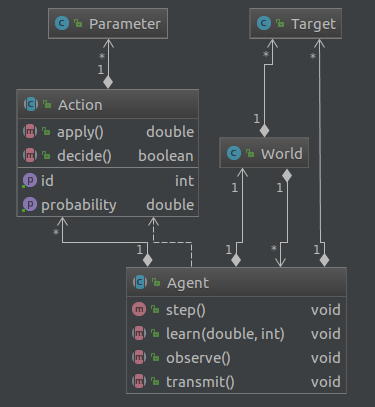

# Proyecto Final:  

## Idea general
Uso del paradigma multiagentes para actuar sobre objetivos múltiples en forma cooperativa. 

Los agentes pueden aprender y transmitir el aprendizaje obtenido.

## Partes del sistema

- Agente: Entidad inteligente que buscar aplicar una o varias acciones sobre los objetivos que pueda alcanzar hasta poderlos llevar a un estado o valor determinado.

- Objetivo: Entidades estáticas o móviles, temporales o permanentes, de valor constante o variable.

- Escenario: 
Marca el tiempo del sistema. 
Contiene referencia parcial o total de los agentes y sus objetivos.

- Acción de un Agente: es lo que puede hacer un agente en un determinado momento para lograr su objetivo.

## Agente

### Comportamiento de un agente
A continuación se describen los tres comportamientos principales de un agente:

#### Observación
Queda en la implementación decidir si el alcance de la visión será limitada o absoluta.

De ser limitada se definirá un radio de alcance.

#### Aprendizaje
Los agentes en cada paso pueden aprender qué acción es más efectiva para un momento determinado. 

Hay dos métodos para lograr esto:
- Recibir el conocimiento de otro agente que ya pasó por la experiencia.
- Aprender de la experiencia por cuenta propia a través de aplicar alguna acción sobre el entorno o el objetivo.

#### Transmisión de conocimiento
Una vez que el agente considera que aprendió algo util lo puede difundir en forma multicast o broadcast a otros agentes.

El conocimiento que se transmite esta asociado a una acción y sus parámetros.

La medida de "conocimiento util" será definido en cada implementación.

### Ciclo de vida de un agente

Por cada paso el agente primero hace una observación del escenario. Donde decide si actualiza su lista de agentes y objetivos.

Luego por cada acción que tiene programada decide si ejecutarla. 
Cada acción tiene asociada una lista de parámetros que son aplicados en el momento que el agente decide correrla. 
La aplicación de una acción puede tener efectos sobre el propio agente, sus vecinos y objetivos.
La accion, al ser aplicada, retorna un numero real que indica qué tan beneficiosa fue para la misión del agente. Este resultado puede ser aprendido.

Por último se puede compartir lo aprendido a los otros agentes. 

~~~java
public void step(){
    observe();
    for(Action action : actions){
        if(action.decide()){
            double result = action.apply();
            learn(result, action.getId());
        }
    }
    transmit();
}
~~~

## Diseño

### Agent.java 
Clase abstract que tiene referencia al World, un conjunto de Target y una lista de Action asociadas.

En cada implementación se debe programar:  

~~~java
    public abstract void learn(double result, int id);

    public abstract void observe();

    public abstract void transmit();
~~~

### Target.java
Clase o Interface que es objetivo de los Agent

### World.java
Contiene referencia parcial o total a los Target y Agent

### Action.java
Clase abstracta que tiene un id para que se puede identificar la tarea entre los distentos objetos.

También tiene una probabilidad de ocurrencia para que cada agente decida si la ejecuta o no.

El método apply devuelve un número que indica que tan buena fue la acción para lograr un mejor efecto sobre el efectivo.

## Casos de aplicación
Implementando algunas clases clave sobre la estructura base se puede aplicar el comportamiento descritpto en otros casos específicos.

### Lucha contra incendios
Los agentes son drones hidrantes con una capacidad de almacenamiento de agua y un alcance para disparar agua.
Los objetivos son los focos de fuego. 
Estos pueden reproducirse dependiendo de las condiciones del entorno como el viento.
Hay puntos de recarga de agua y de energía donde los agentes después de actuar sobre el fuego tienen que recargar.
Tendrian sensores visuales, de temperatura y de viento.

### Lucha contra la sequia de un campo
Los agentes son drones con aspersores. 
Los objetivos con áreas fijas donde esta faltando agua.
Hay puntos para cargar agua y energía.
Los drones se distribuyen el area de acuedo a la sequedad observada por su visión.

### Control de infecciones en una población
Los agentes seran los terapeutas.
Los objetivos los ciudadanos infectados.
Un ciuidadano puedo no saber que esta infectado pero presentará sintomas.
Los terapeutas los convenceran de que se hagan tratatar y de que no contagien a la población.
Los terapeutas pueden sospechar que las personas que tuvieron contacto con los infectados pudieron haber contraido la infeccion, de esta manera pueden actuar antes evitando que la epidemia se disperse.

### Eliminación de tumores malignos
Los agentes son nanobots en el torrente sanguineo. 
Puden moverse y buscar sus objetivos que son las células cancérigenas. 
Actuan sobre las mismas destruyendolas.
Un agente que encuentre células cancerigenas avisa al resto para que lo ayuden a destruir el tumor.
Los agentes pueden aprender a distinguir un tumor por el color, la forma o alguna propiedad de la célula.

### Prevención de delitos con drones
Los agenetes son drones con cámara que buscan conflictos en la via publica.
De encontrar algun conflicto alerta a la policía. 
Para sospechar o prevenir delitos se mueve a donde cree que puede ocurrir alguno.
Puede aprender patrones de comportamiento.
De necesitar ayuda para procesar movimientos de masas puede llamar a otros agentes.

| proyecto    | objetivo              | agentes | aprendizaje                                           | requisito               |
|-------------|-----------------------|---------|-------------------------------------------------------|-------------------------|
| incendios   | fijo/reproducible     | móviles | disparo dependiente del viento                        | carga de agua y energía |
| sequía      | fijo/reproducible     | móviles | cantidad de riego dependiendo de variables climáticas | carga de agua y energía |
| infecciones | móviles/reproducibles | móviles | detectar síntomas                                     |                         |
| tumores     | fijo/reproducible     | móviles | color de la célula                 |               |
| delitos     | móvil                 | móviles | movimiento de un grupo de personas | carga energía |